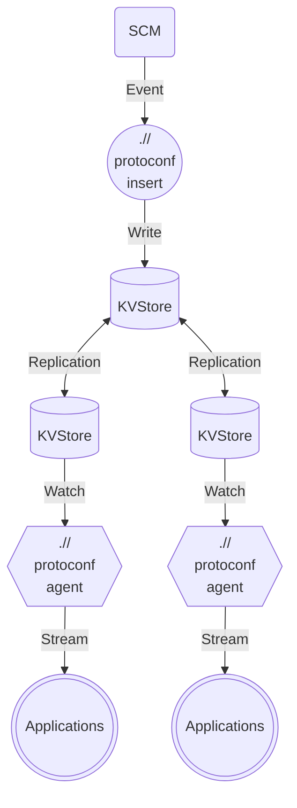

# Production Architecture

The production architecture of protoconf involves several components working together to provide dynamic, event-driven configuration management. This architecture is designed to support high availability, scalability, and real-time updates.

## Architecture Overview

1. **Source Code Management (SCM):** This is where your configuration files and your application code reside. Whenever there is an event (such as a commit or a merge), it triggers the next step in the process.

2. **protoconf insert:** This is a command that is run in response to events from the SCM. It takes the configuration files and inserts them into the key-value store. This command can be triggered manually, or automatically via webhooks or CI/CD pipelines.

3. **Key-Value Store (Consul/Etcd/Zookeeper):** This is the centralized store where all the configurations are stored. The key-value store ensures high availability and distributed access to the configurations.

4. **protoconf agent:** This is a service that listens for changes in the key-value store. When a configuration is inserted or updated, the protoconf agent picks up the change and prepares to distribute it.

5. **Applications:** These are your actual applications that need the configurations. They connect to the protoconf agent and receive real-time configuration updates via gRPC.

This architecture allows for rapid response to configuration changes, ensuring that your applications always have the most up-to-date configurations. This is particularly useful in a microservices architecture where multiple services need to stay in sync with their configurations.
